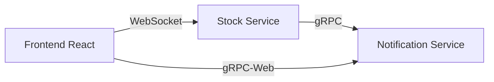

# StockPulse - Real-time Stock Monitoring System

StockPulse is a modern, microservices-based real-time stock monitoring system built with gRPC, React, Spring Boot, and FastAPI.

## Architecture

## Key Features

-  Real-time stock price monitoring
-  Custom price alerts
-  Push notifications
-  Secure WebSocket connections
-  gRPC-based microservices communication

## Tech Stack

-  **Frontend**: React 18, TypeScript, Vite, WebSocket
-  **Stock Service**: Python FastAPI, gRPC
-  **Notification Service**: Spring Boot 3, Java 17, gRPC

## Getting Started

### Prerequisites

-  Java 17+
-  Python 3.9+
-  Node.js 18+
-  Docker & Docker Compose

### Development Setup

1. Clone the repository

## Project Structure
